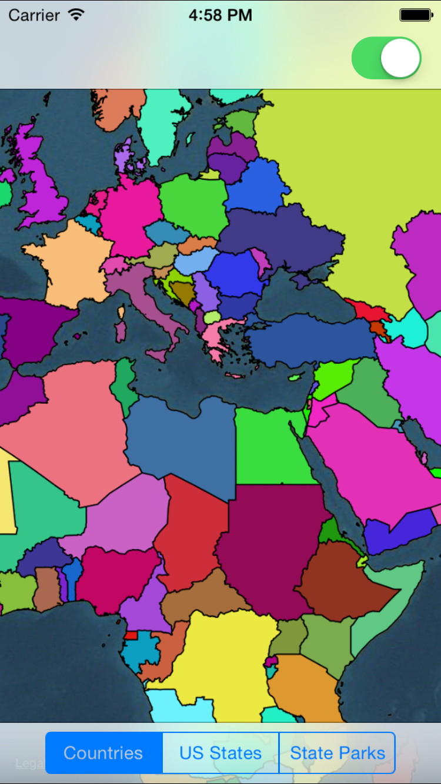
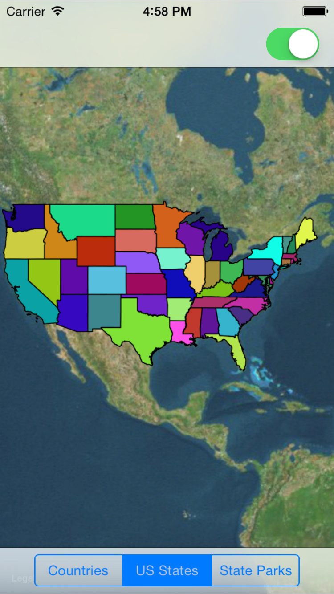
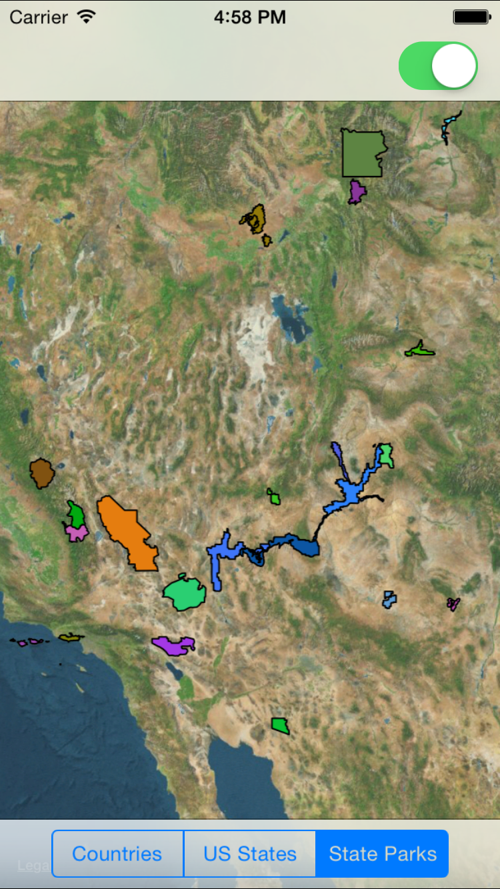

Mapkit_ShapeFile
================

  

  

  

##Overview 

Uses ESRI Shape Files to draw Overlays on MKMapViews 

##Installation

Pod install in root directory and use XCWorkspace 

##Architecture

###ViewController+MapOverlay

Interacts with the MKPoloygonRenderer to handle drawing of geospatial regions using defined fill color stroke color and line width 

###GeoRegion

Encapsulates geospatial data for a given georegion. Initializer handles parsing of SHPObject and storing shape data into Objective-C object.  

###GeoRegionStack

Handles iterating through colection of GeoRegion and providing an Array of geoRegion objects.  
